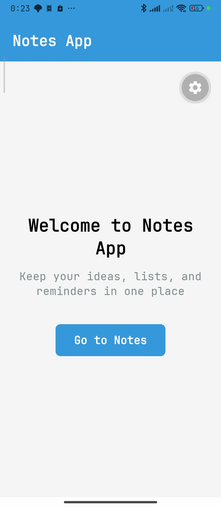
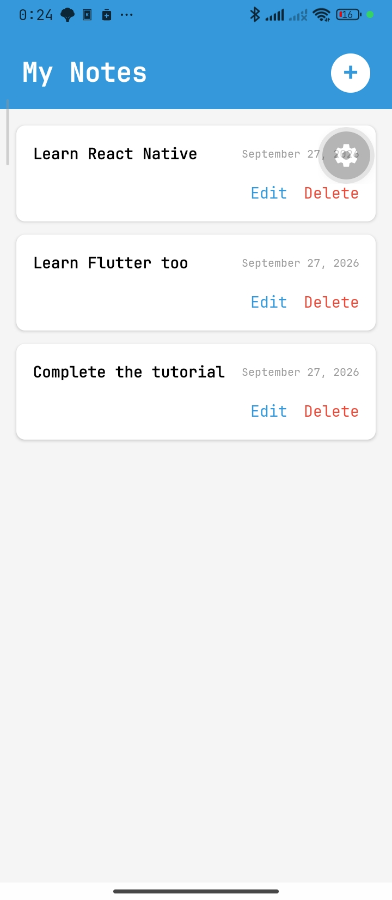

# NotesApp

A small cross-platform notes application built with **Expo** and **React Native**, for iOS, Android, and web.

## Contents

- [Overview](#overview)
- [Screenshots](#screenshots)
- [Features](#features)
- [Tech Stack](#tech-stack)
- [Project Structure](#project-structure)
- [Prerequisites](#prerequisites)
- [Getting Started](#getting-started)
- [Available Scripts](#available-scripts)
- [Configuration](#configuration)
- [Architecture](#architecture)
- [Known Limitations](#known-limitations)
- [License](#license)

## Overview

NotesApp is a lightweight, client-only note-taking app. It opens on a welcome screen and lets the user manage a list of notes: create, edit, and delete.

Notes live in React component state only, seeded with three sample notes on launch. There is no backend, no database, and no persistence — reloading the app resets the list. This keeps the project focused on navigation, list rendering, and modal-based input.

### Screens

| Route | File | Purpose |
| --- | --- | --- |
| `Home` | `screens/HomeScreen.js` | Welcome screen with a button that navigates to `Notes`. Initial route. |
| `Notes` | `screens/NotesScreen.js` | Flat list of notes with add, edit, and delete actions. Owns all note state. |

## Screenshots

| Home | Notes |
| :---: | :---: |
|  |  |

## Features

- Two-screen stack navigation (`Home` → `Notes`) with hidden native headers.
- Create a note through a slide-up modal with an auto-focused multiline text input.
- Edit an existing note, reusing the same modal with an "Edit Note" title.
- Delete a note behind a confirmation modal.
- Notes seeded and date-stamped with `toLocaleDateString`.
- Empty-state message when the list has no notes.
- Runs on Android, iOS, and web.

## Tech Stack

- [Expo](https://expo.dev) SDK `~57.0.25` (`expo`, `expo-status-bar`)
- React Native `0.86.3` with React `19.2.3`
- `@react-navigation/native` `^7.4.1` + `@react-navigation/native-stack` `^7.19.2`
- `react-native-screens`, `react-native-safe-area-context`, `react-native-gesture-handler`
- Plain JavaScript — no TypeScript, no styling library (`StyleSheet` only)
- npm for dependency management (`package-lock.json`)

## Project Structure

```text
NotesApp/
├── App.js                    # Root component: NavigationContainer + native stack
├── index.js                  # Entry point (package.json "main"), registerRootComponent
├── app.json                  # Expo config: name, icons, orientation, platform settings
├── package.json              # Dependencies and npm scripts
├── LayoutDemo.js             # Standalone layout sandbox, not wired into the app
├── screens/
│   ├── HomeScreen.js         # Welcome screen
│   └── NotesScreen.js        # Note list + all note state/CRUD logic
├── components/
│   ├── NoteItem.js           # Single row: content, date, Edit/Delete actions
│   ├── NoteInput.js          # Add/Edit modal with multiline TextInput
│   └── NonteDeleteModal.js   # Delete confirmation modal (file name as-is)
├── assets/                   # App icons, adaptive Android icon, splash, favicon
├── docs/screenshots/         # Screenshots used in this README (home.jpg, notes.jpg)
├── android/                  # Generated native Android project (git-ignored)
├── AGENTS.md                 # Expo/React Native project conventions for AI agents
└── LICENSE                   # MIT (Expo template)
```

- `screens/` and `components/` are kept outside the Expo Router `app/` convention — this project uses React Navigation directly, not file-based routing.
- `android/` and `ios/` are produced by Expo's Continuous Native Generation and are listed in `.gitignore`. Do not edit them by hand; regenerate with `npx expo prebuild`.
- `components/NonteDeleteModal.js` contains a typo in the file name; the exported component itself is correctly named `NoteDeleteModal`.

## Prerequisites

- Node.js and npm (no version is pinned in the repo; use a current active LTS).
- The **Expo Go** app on a physical device, or an Android emulator / iOS simulator.
- For web: a modern browser.
- Only for native builds: Android Studio (Android SDK) or Xcode. The generated Android project uses Gradle `9.3.1` with Kotlin entry points (`MainActivity.kt`, `MainApplication.kt`).

## Getting Started

```bash
git clone https://github.com/zidi-abderrahmen/notes-app-react-native.git
cd NotesApp
npm install
npm start
```

Metro starts and prints a QR code plus dev-menu shortcuts. Scan the QR code with Expo Go, or press `a` (Android), `i` (iOS), or `w` (web) in the terminal.

### Run on a specific platform

```bash
npm run android
npm run ios
npm run web
```

### Generate the native projects (optional)

`android/` and `ios/` are generated and not tracked in git:

```bash
npx expo prebuild --clean
npx expo run:android   # or: npx expo run:ios
```

A development build is required if you add any library with native code, since Expo Go only bundles its own native modules.

## Available Scripts

| Script | Command | Description |
| --- | --- | --- |
| `npm start` | `expo start` | Start the Metro dev server / Expo dev menu |
| `npm run android` | `expo start --android` | Start the dev server and open on an Android device or emulator |
| `npm run ios` | `expo start --ios` | Start the dev server and open in an iOS simulator |
| `npm run web` | `expo start --web` | Start the dev server and open in the browser |

## Configuration

All app configuration lives in `app.json`. There are no environment variables, `.env` files, or secrets in this project.

```json
{
  "name": "NotesApp",
  "slug": "NotesApp",
  "version": "1.0.0",
  "orientation": "portrait",
  "userInterfaceStyle": "light",
  "ios": { "supportsTablet": true }
}
```

Icon, adaptive-icon, and favicon paths point to files in `assets/`. Android adaptive-icon colors are defined in `app.json` and the generated `android/app/src/main/res/values/colors.xml`.

## Architecture

- **Entry** — `index.js` imports `react-native-gesture-handler` (must come first) and calls `registerRootComponent(App)`.
- **Navigation** — `App.js` wraps the tree in `NavigationContainer` and a native stack with routes `Home` and `Notes`, both with `headerShown: false`. `HomeScreen` receives `navigation` and calls `navigation.navigate("Notes")`.
- **State** — `NotesScreen` owns all note state via `useState`: the note list, input-modal visibility, delete-modal visibility, current draft text, the note being edited, and the note queued for deletion. The CRUD handlers (`saveNote`, `editNote`, `deleteNote`, `askDeleteNote`, `closeModal`, `closeDeleteModal`) live alongside it. There is no context, store, or reducer.
- **Components** — presentational only, receiving data and callbacks via props. `NoteItem` is rendered by the screen's `FlatList`; `NoteInput` and `NoteDeleteModal` are controlled `Modal`s.
- **Styling** — each file defines its own `StyleSheet` at the bottom. There is no shared theme or design tokens; `#3498db` (primary) and `#f5f5f5` (background) recur across screens.

## Known Limitations

- Notes are not persisted — state is lost on reload.
- Editing a note writes an `updatedAt` field, but the UI always renders `createdAt`.
- The project has no lint, typecheck, or test tooling configured.

## License

[MIT](LICENSE) — © 650 Industries, Inc. (Expo template).
